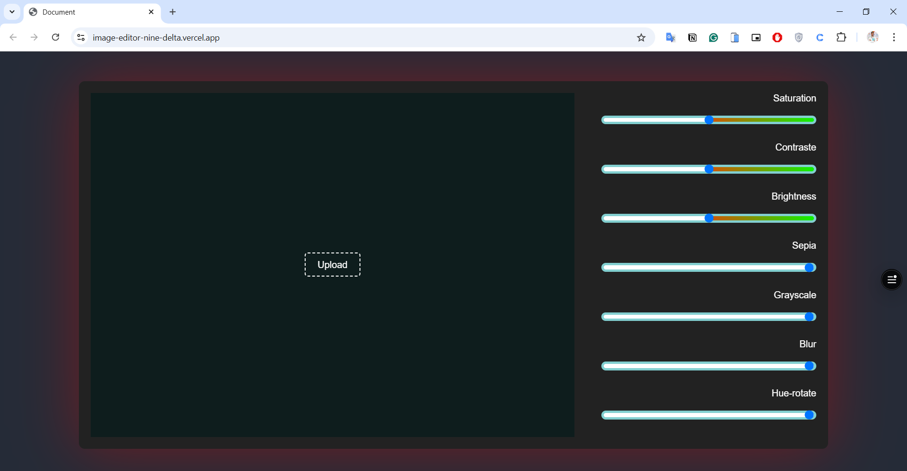
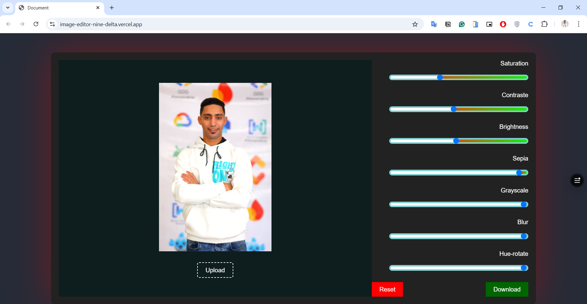

# image-editor:
this projects is to edit pic u can drop it into

u can use filters to edit it

if u want to reset anything , u can use reset button

then u can download the image after editing by download button

<h1 align="center">Home Page</h1>

<h1 align="center">Image Editor</h1>

### the website on live at :
https://image-editor-nine-delta.vercel.app/